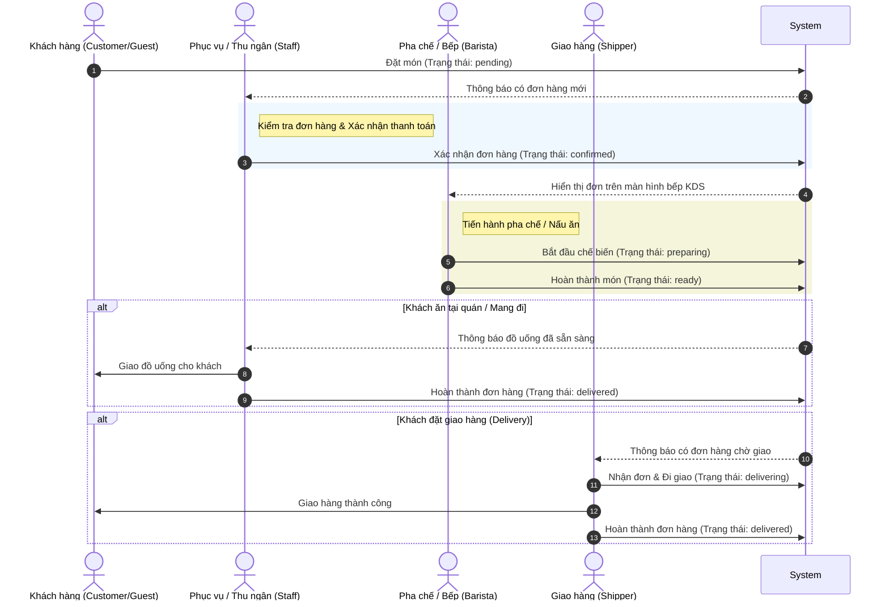

# 📘 CẨM NANG NÂNG CẤP HỆ THỐNG PHÂN QUYỀN (ROLE) - CAFE APP

Tài liệu này cung cấp hướng dẫn toàn diện từ lý thuyết, thiết kế hệ thống đến hướng dẫn sửa mã nguồn chi tiết để tích hợp các Role mới (**Staff**, **Barista**, **Shipper**) vào dự án **Cafe App** của bạn.

---

## 🗺️ 1. Bản Đồ Quy Trình Vận Hành (Workflow)

Dưới đây là quy trình xử lý đơn hàng thực tế khi có sự tham gia của các Role mới:



---

## 📊 2. Ma Trận Quyền Hạn (Permission Matrix)

Để đảm bảo bảo mật và phân tách trách nhiệm (Separation of Duties), các quyền hạn trên hệ thống được phân bổ như sau:

| Module / API Endpoint | Customer | Guest | Staff | Barista | Shipper | Admin |
| :--- | :---: | :---: | :---: | :---: | :---: | :---: |
| **Xem Menu & Giá sản phẩm** | 🟢 Đầy đủ | 🟢 Đầy đủ | 🟢 Đầy đủ | 🟢 Đầy đủ | ❌ Không | 🟢 Đầy đủ |
| **Tạo Đơn Hàng (Đặt món)** | 🟢 Đầy đủ | 🟢 Đầy đủ | 🟢 Đầy đủ | ❌ Không | ❌ Không | 🟢 Đầy đủ |
| **Hủy Đơn Hàng Của Mình** | 🟢 Chỉ khi `pending` | 🟢 Chỉ khi `pending` | ❌ Không | ❌ Không | ❌ Không | 🟢 Mọi lúc |
| **Xem Toàn Bộ Đơn Hàng Quán** | ❌ Không | ❌ Không | 🟢 Đầy đủ | 🟢 Chỉ đơn chuẩn bị | 🟢 Chỉ đơn giao | 🟢 Đầy đủ |
| **Cập nhật Trạng thái Đơn hàng** | ❌ Không | ❌ Không | 🟢 Chỉ `confirmed`/`delivered` | 🟢 Chỉ `preparing`/`ready` | 🟢 Chỉ `delivering`/`delivered` | 🟢 Đầy đủ |
| **Quản lý Bàn ăn (`table`)** | ❌ Không | ❌ Không | 🟢 Chỉ thay đổi trạng thái trống | ❌ Không | ❌ Không | 🟢 Đầy đủ |
| **Quản lý Sản phẩm, Menu, Mã giảm giá** | ❌ Không | ❌ Không | ❌ Không | ❌ Không | ❌ Không | 🟢 Đầy đủ |
| **Xem Doanh thu & Quản lý Tài khoản** | ❌ Không | ❌ Không | ❌ Không | ❌ Không | ❌ Không | 🟢 Đầy đủ |

---

## 🛠️ 3. Hướng Dẫn Sửa Code Chi Tiết (Code Implementation Guide)

### Bước 3.1: Định Nghĩa Các Hằng Số (Constants Sync)

Đây là bước cực kỳ quan trọng vì bạn cần đồng bộ hằng số giữa Backend và Frontend để tránh lỗi Runtime.

#### 📂 Đầu Backend: `backend/constants/roles.js`
Thay đổi cấu trúc file để thêm 3 role mới:
```javascript
/**
 * User Roles Constants
 * ⚠️ MUST SYNC with Frontend/src/constants/roles.js
 */

module.exports = {
    ADMIN: 'admin',
    STAFF: 'staff',
    BARISTA: 'barista',
    SHIPPER: 'shipper',
    CUSTOMER: 'customer'
};
```

#### 📂 Đầu Frontend: `Frontend/src/constants/roles.js`
Đồng bộ các key tương ứng và thêm nhãn tiếng Việt để hiển thị trên giao diện quản trị:
```javascript
export const ROLES = {
  ADMIN: 'admin',
  STAFF: 'staff',
  BARISTA: 'barista',
  SHIPPER: 'shipper',
  CUSTOMER: 'customer',
  GUEST: 'guest',
};

export const ROLE_LABELS = {
  [ROLES.ADMIN]: 'Quản trị viên',
  [ROLES.STAFF]: 'Nhân viên phục vụ',
  [ROLES.BARISTA]: 'Nhân viên pha chế',
  [ROLES.SHIPPER]: 'Nhân viên giao hàng',
  [ROLES.CUSTOMER]: 'Khách hàng',
  [ROLES.GUEST]: 'Khách vãng lai (QR)',
};
```

---

### Bước 3.2: Nâng Cấp Route Middleware trên Backend

Hiện tại, file `backend/middleware/roleMiddleware.js` đang sử dụng hàm `allow('admin', 'customer')` để phân quyền. Chúng ta cần bổ sung thêm các helper middlewares để dễ dàng sử dụng trên các router cụ thể.

#### 📂 Đầu Backend: `backend/middleware/roleMiddleware.js`
Hãy đảm bảo bạn đã import các role mới và bổ sung các helper:
```javascript
const { ROLES } = require('../constants/roles');

// Thêm các helper kiểm tra vai trò cụ thể:

/**
 * Staff or Admin middleware
 */
module.exports.isStaffOrAdmin = (req, res, next) => {
  if (!req.user) return res.status(401).json({ message: 'Authentication required' });
  
  if (req.user.role !== ROLES.ADMIN && req.user.role !== ROLES.STAFF) {
    return res.status(403).json({ message: 'Access denied. Admin or Staff only.' });
  }
  next();
};

/**
 * Barista or Admin middleware
 */
module.exports.isBaristaOrAdmin = (req, res, next) => {
  if (!req.user) return res.status(401).json({ message: 'Authentication required' });
  
  if (req.user.role !== ROLES.ADMIN && req.user.role !== ROLES.BARISTA) {
    return res.status(403).json({ message: 'Access denied. Admin or Barista only.' });
  }
  next();
};
```

---

### Bước 3.3: Mở Rộng API Cập Nhật Đơn Hàng

Chỉnh sửa file định nghĩa Route đơn hàng để cho phép các role phục vụ, pha chế và shipper tham gia cập nhật trạng thái đơn hàng.

#### 📂 Đầu Backend: `backend/routes/orderRoutes.js`
Cập nhật route `/:id/status` để cho phép các role phục vụ:
```javascript
// Trước đây:
// router.put('/:id/status', authMW, allow('admin'), validateId, oc.updateOrderStatus);

// Sau khi sửa đổi:
router.put(
  '/:id/status', 
  authMW, 
  allow('admin', 'staff', 'barista', 'shipper'), 
  validateId, 
  oc.updateOrderStatus
);
```

#### 📂 Logic Điều Phối Trạng Thế trong `backend/controllers/orderController.js`
Trong phương thức `updateOrderStatus`, bạn cần thêm ràng buộc bảo mật để đảm bảo nhân viên không chuyển sai quyền hạn của mình:
```javascript
const { ROLES } = require('../constants/roles');
const { ORDER_STATUS } = require('../constants/orderStatus');

exports.updateOrderStatus = async (req, res) => {
  const { id } = req.params;
  const { status } = req.body;
  const userRole = req.user.role;

  try {
    const order = await Order.findByPk(id);
    if (!order) return res.status(404).json({ message: "Không tìm thấy đơn hàng" });

    // Kiểm tra ràng buộc quyền hạn theo trạng thái muốn chuyển đổi
    if (userRole === ROLES.BARISTA && status === ORDER_STATUS.CONFIRMED) {
      return res.status(403).json({ message: "Pha chế không có quyền xác nhận đơn hàng." });
    }
    
    if (userRole === ROLES.SHIPPER && status === ORDER_STATUS.PREPARING) {
      return res.status(403).json({ message: "Shipper không có quyền đưa đơn hàng vào bếp." });
    }

    // Tiến hành cập nhật trạng thái hợp lệ...
    order.status = status;
    await order.save();

    return res.json({ message: "Cập nhật trạng thái thành công!", order });
  } catch (error) {
    return res.status(500).json({ message: error.message });
  }
};
```

---

## 🖥️ 4. Ý Tưởng Thiết Kế UI Cho Từng Role (Frontend)

Khi một tài khoản đăng nhập thành công, dựa trên trường `role` trả về từ API Token, React App sẽ hiển thị Dashboards/Layout chuyên biệt:

### 4.1. Giao Diện Nhân Viên Phục Vụ (`staff`)
*   **Màn hình chính:** Sơ đồ bàn ăn trực quan (được chia theo tầng/khu vực). Bàn có khách hiển thị màu đỏ, bàn trống màu xanh.
*   **Tính năng chính:**
    *   Click vào bàn trống ➔ Mở menu tạo nhanh đơn hàng (POS tại bàn).
    *   Click vào bàn đang phục vụ ➔ Xem danh sách đồ uống khách đã gọi, thêm món mới hoặc gửi yêu cầu thanh toán (in hóa đơn tạm tính).

### 4.2. Giao Diện Nhân Viên Pha Chế (`barista`) - KDS
*   Không có thanh sidebar hay menu phức tạp. Thiết kế dạng tối ưu cho màn hình Tablet treo ở quầy pha chế.
*   **Màn hình dạng cột Kanban:**
    *   **Cột 1: Chờ Làm (Confirmed):** Danh sách các ly/đơn hàng vừa được xác nhận.
    *   **Cột 2: Đang Làm (Preparing):** Các món đang được pha chế. Có nút "Xong" để chuyển trạng thái.
*   Tích hợp âm thanh chuông "Ting Ting" mỗi khi có đơn hàng mới đẩy vào bếp.

### 4.3. Giao Diện Nhân Viên Giao Hàng (`shipper`)
*   Tối ưu hóa hiển thị trên màn hình điện thoại di động.
*   **Màn hình chính:** Danh sách đơn hàng cần giao (địa chỉ, số điện thoại khách, tổng tiền cần thu).
*   Có nút bấm tích hợp nhanh cuộc gọi (Call) và xem bản đồ đường đi.

---

## 🔒 5. Kiểm Soát Bảo Mật & Best Practices

1.  **JWT Payload:** Đảm bảo trường `role` được mã hóa trực tiếp trong token JWT khi đăng nhập:
    ```javascript
    const token = jwt.sign(
      { id: user.id, username: user.username, role: user.role },
      process.env.JWT_SECRET,
      { expiresIn: '7d' }
    );
    ```
2.  **Không Tin Tưởng Frontend (Never Trust the Frontend):** Dù Frontend đã ẩn các nút bấm/tính năng không thuộc quyền hạn của người dùng, toàn bộ các API Endpoints trên Backend **BẮT BUỘC** phải có kiểm tra quyền bằng `roleMiddleware`.
3.  **Audit Logs (Lịch sử hoạt động):** Khi cập nhật trạng thái đơn hàng hoặc thông tin quan trọng, hãy ghi lại tên nhân viên thực hiện (ví dụ: *"Đơn hàng được xác nhận bởi Nhân viên A lúc 14:00"*). Điều này giúp dễ dàng đối soát khi xảy ra thất thoát tài chính hoặc sai sót món ăn.

---

## 🚀 6. Kế Hoạch Triển Khai (Action Plan)

Nếu bạn muốn bắt tay vào nâng cấp hệ thống phân quyền này ngay bây giờ, đây là lộ trình:

- [ ] **Bước 1:** Cập nhật các file định nghĩa hằng số Roles ở cả hai phía Frontend và Backend.
- [ ] **Bước 2:** Cập nhật file Database Seed (`seedData.js`) để tạo sẵn 3 tài khoản mẫu ứng với 3 role mới:
    *   `staff_test` (Mật khẩu: `12345678`)
    *   `barista_test` (Mật khẩu: `12345678`)
    *   `shipper_test` (Mật khẩu: `12345678`)
- [ ] **Bước 3:** Sửa đổi Middleware phân quyền và Route Backend.
- [ ] **Bước 4:** Xây dựng/Tích hợp giao diện quản trị và phân luồng điều hướng ở Frontend dựa trên vai trò người dùng đăng nhập.

---

*Chúc dự án Cafe App của bạn ngày càng hoàn thiện và vận hành hiệu quả! Mọi thắc mắc trong quá trình code, hãy gửi yêu cầu cho Antigravity để được trợ giúp 24/7.* ☕🚀
